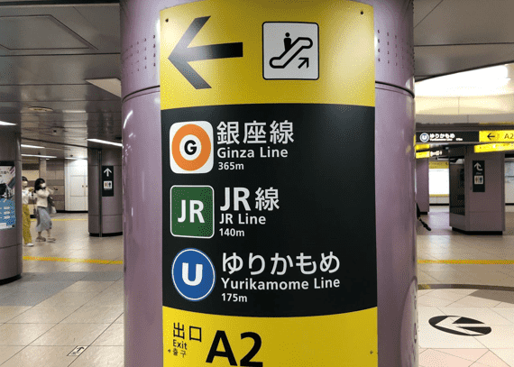
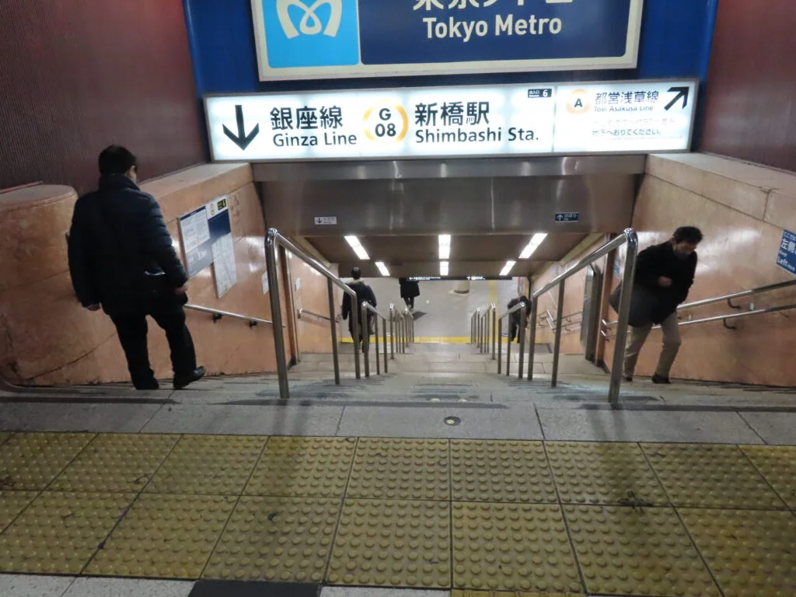

# Ceremonia del 24 de Octubre
## Detalles
- Fecha: 24 de octubre, 2025
- MARRY GRANT AKASAKA
  - Dirección:
    - En inglés: `Tokyo, Minato City, Akasaka, 2 Chome−14−5 Daiwa Akasaka Biru`
    - En japonés: `東京都港区赤坂2-14-5 Daiwa赤坂ビル`
  - Hora de llegada:
    - La hora de llegada oficial es a las 11:45 am.
    - Sin embargo, a la familia Martínez les sugiero apuntarle a llegar a las **10:00 am**. (por si tienen contratiempos con los trenes). Si llegan antes de las 11:45, les recomiendo ver tiendas o cafés en las áreas circundantes, ya que solo se puede entrar a partir de la hora oficial. 
- Estación de tren:
    - En inglés: `Tameike-sannō`
    - En japonés: `溜池山王駅`
    - （※: Existen otras estaciones cerca de MARRY GRANT, pero les recomendamos Tameike-sanno debido a qué requiere pocos transbordos de tren）

## Ruta (Cómo llegar)
(Nota: si por alguna razón pierden un tren durante el transbordo, **que no cunda el pánico**. Los trenes de la línea Ginza son frecuentes así que se puede tomar el siguiente)
- Ruta recomendada:
  ````
  Kamata [Línea: Keihi-Tohoku ]
     ↓
  Shimbashi [Línea: Keihi-Tohoku ]
     ↓
  (Cambio de trenes!!!)
     ↓  
  Shimbashi [Línea: Ginza ]
     ↓
  Tameike-sannō [Línea: Ginza ]→
  ````
- Salida de la estación recomendada: `7`
  - La estación de Tameike-sannō tiene varias salidas, MARRY GRANT recomienda esta por ser la más cercana al establecimiento.

 ### Ejemplos de Rutas con Google Mapas
 He aquí tres diferentes variaciones de la ruta recomendada proporcionadas por Google Maps. Todas son para llegara más o menos como a las 10:00 am. 
 1. [Ruta 1](https://maps.app.goo.gl/2SJnBpbExorPD6b67)
 2. [Ruta 2](https://maps.app.goo.gl/Dghq249ww3qL11wr8)
 3. [Ruta 3](https://maps.app.goo.gl/TGjiUGsu6VCqFkPv9)

### Detalles del transbordo. 
- Esta vez tienen que transbordar de un tren de la companía `JR`(línea Keihin-Tohoku) a uno de la compañía `Tokyo Metro`(línea Ginza).
- Esto significa que tendrán que salir por el torniquete de `JR` y entrar por el torniquete de `Tokyo Metro`
- En la estación del transbordo, `Shimbashi`, al bajarse del tren, busquen las señalizaciones que indiquen la dirección de la línea Ginza. He aquí dos ejemplos de las señalizaciones que podrían haber:
  
  
    
   
## Otros recordatioros
- Favor traer los regalitos para la familia de Kozue. Quisiéramos entregárselos durante el almuerzo.
- **Papi**: favor traer tu speech.
- **Ale**: favor traer preparada las pabritas que te pedí. 
